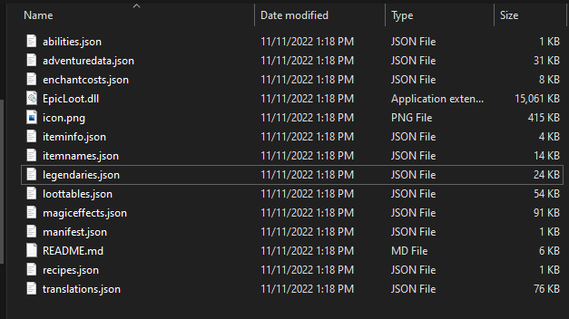

# epic-loot-custom-items-valheim
Custom items for valheim epic loot system

Add your custom items to the appropriate sections in the legendaries.json file
Add descriptions to the translations.json files where applicable, 
Reboot server/client and enjoy

---

To use, download the release file zip file, and extract to the following directories

If using the r2ModManager
`%AppData%\r2modmanPlus-local\Valheim\profiles\Default\BepInEx\plugins\RandyKnapp-EpicLoot`

_*Note:*_ if you are not using the default profile, replace the `Default` in the uri above with your profile name

If NOT using R2ModManager:
`{SteamLibrary}\SteamApps\common\Valheim\BepInEx\plugins\RandyKnapp-EpicLoot`

Make certain to choose to _overwrite/replace_ when exracting
Should look something like:

---

The configurations were forked from the Epic Loot Valheim plugin by Randy Knapp

*Source: [RandyKnapp/Github](https://github.com/RandyKnapp/ValheimMods/tree/main/EpicLoot)*